This application is backend program that built using PHP as the programming language and using Laravel Framework. For database management this app using MySQL and also implements JWT Security for user authentication and generating token.

Developed by : Nabila Suci Syabani - Batch #17 Offline Jakarta

### AUTHENTICATION

#### REGISTER

```http
  POST /register
```

##### INPUT

```json
{
    "email": "tokoweb@gmail.com",
    "password": "tokoweb"
}
```

##### OUTPUT

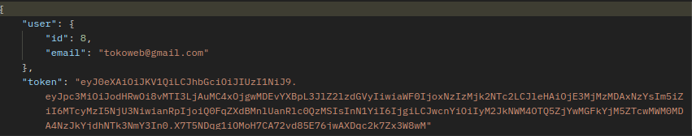

#### LOGIN

```http
  POST /api/todo/auth/login
```

##### INPUT

```json
{
    "username": "admin1",
    "password": "admin#1234"
}
```

##### OUTPUT

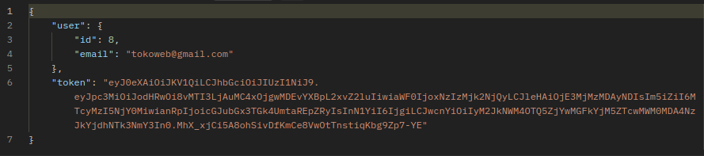

### CATEGORY

#### CREATE CATEGORY (AUTHENTICATED)

```http
  POST /category-products
```

##### INPUT

```
Authorization (Add Login Token)
Type - Bearer Token
Token = {add token when login}
```

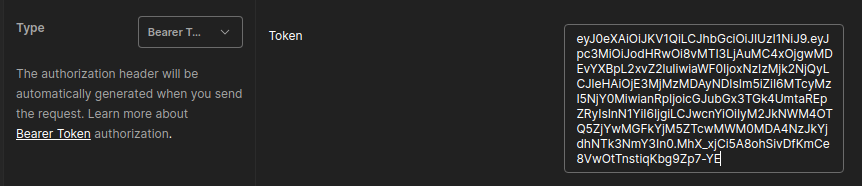

```json
{
    "name": "Furniture"
}
```

##### OUTPUT

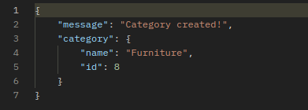

#### GETALL CATEGORY (AUTHENTICATED)

```http
  GET /category-products
```

##### INPUT

```
Authorization (Add Login Token)
Type - Bearer Token
Token = {add token when login}
```


##### OUTPUT

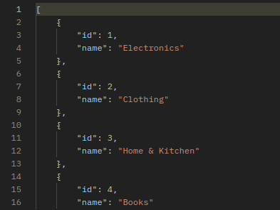
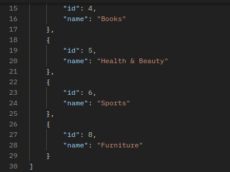

#### GET BY ID CATEGORY (AUTHENTICATED)

```http
  GET /category-products/{id}
```

##### INPUT

```
Authorization (Add Login Token)
Type - Bearer Token
Token = {add token when login}
```


##### OUTPUT

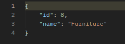

#### UPDATE BY ID CATEGORY (AUTHENTICATED)

```http
  PUT /category-products/{id}
```

##### INPUT

```
Authorization (Add Login Token)
Type - Bearer Token
Token = {add token when login}
```


```json
{
    "name": "Home Furniture"
}
```

##### OUTPUT

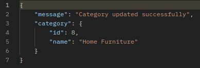

#### DELETE BY ID CATEGORY (AUTHENTICATED)

```http
  DELETE /category-products/{id}
```

##### INPUT

```
Authorization (Add Login Token)
Type - Bearer Token
Token = {add token when login}
```


##### OUTPUT

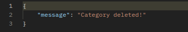

### PRODUCTS

#### CREATE PRODUCTS (AUTHENTICATED)

```http
  POST /products
```

##### INPUT

```
Authorization (Add Login Token)
Type - Bearer Token
Token = {add token when login}
```


```json
{
    "name": "Kursi",
    "price": 100000,
    "image": "kursi.jpg",
    "category_id": 8
}
```

##### OUTPUT

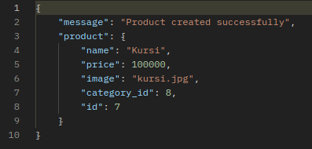

#### GETALL PRODUCTS (AUTHENTICATED)

```http
  GET /products
```

##### INPUT

```
Authorization (Add Login Token)
Type - Bearer Token
Token = {add token when login}
```

##### OUTPUT

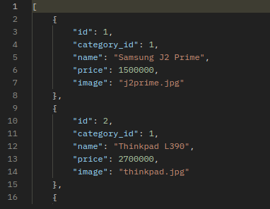
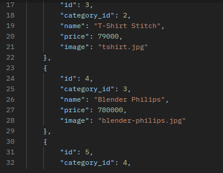
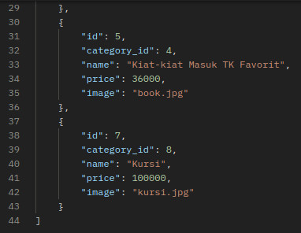

#### GET BY ID PRODUCTS (AUTHENTICATED)

```http
  GET /products/{id}
```

##### INPUT

```
Authorization (Add Login Token)
Type - Bearer Token
Token = {add token when login}
```


##### OUTPUT

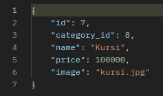

#### UPDATE BY ID PRODUCTS (AUTHENTICATED)

```http
  PUT /products/{id}
```

##### INPUT

```
Authorization (Add Login Token)
Type - Bearer Token
Token = {add token when login}
```


```json
{
    "name": "Meja",
    "price": 100000,
    "image": "meja.jpg",
    "category_id": 8
}
```

##### OUTPUT

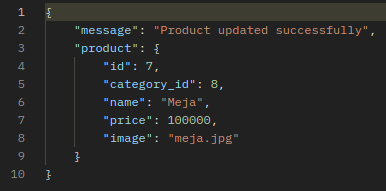

#### DELETE BY ID CATEGORY (AUTHENTICATED)

```http
  DELETE /category-products/{id}
```

##### INPUT

```
Authorization (Add Login Token)
Type - Bearer Token
Token = {add token when login}
```


##### OUTPUT

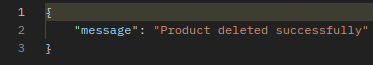
